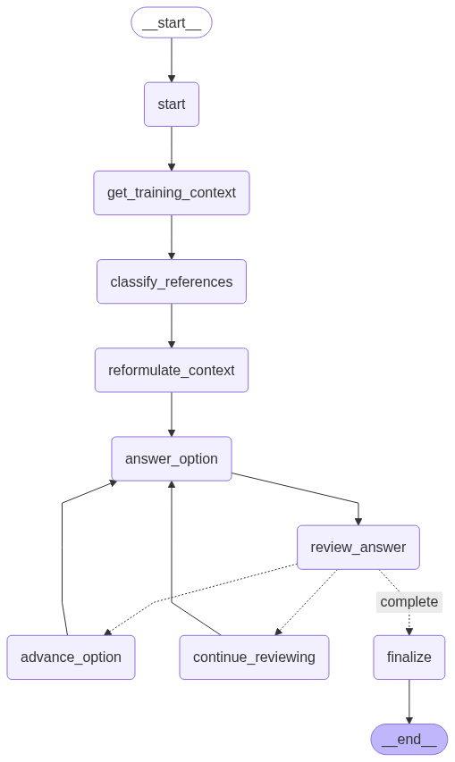

# 🎓 Certification Agent

An agent that provides detailed explanations for multiple-choice certification exam questions using retrieval-augmented generation (RAG) based on training materials.

## 🏗️ Architecture & Workflow



The agent follows a sophisticated multi-step workflow:

1. **Start**: Initialize the explanation generation process
2. **Get Training Context**: Search vector database for relevant training materials based on question content
3. **Classify References**: Use LLM to determine which retrieved references are actually relevant
4. **Reformulate Context**: Optimize and structure the context for better explanation generation
5. **Answer Option**: Generate explanation for current answer option
6. **Review Answer**: Quality check the generated explanation
7. **Conditional Flow**: Based on review results:
   - **Continue Reviewing**: Refine the current explanation if quality is insufficient
   - **Advance Option**: Move to next option if current one is satisfactory
   - **Complete**: Finish if all options are explained satisfactorily
8. **Finalize**: Complete the process and return results

## 🛠️ Tech Stack

### Core Framework
- **[LangChain](https://python.langchain.com/)** - LLM application framework
- **[LangGraph](https://langchain-ai.github.io/langgraph/)** - Workflow orchestration and state management
- **[FastAPI](https://fastapi.tiangolo.com/)** - High-performance API framework

### Vector Database
- **[Typesense](https://typesense.org/)** - Fast, typo-tolerant search engine for RAG

### Additional Tools
- **[Pydantic](https://pydantic.dev/)** - Data validation and settings management
- **[Jinja2](https://jinja.palletsprojects.com/)** - Template engine for prompts

### Installation

1. **Install dependencies**
```bash
uv sync
```

2. **Set up environment variables**
```bash
cp .env.example .env
```

Configure your `.env` file:
```env
# Anthropic or OpenAI
ANTHROPIC_API_KEY=your_anthropic_api_key
OPENAI_API_KEY=your_openai_api_key

# Typesense
TYPESENSE_HOST=localhost or typesense if using Docker compose
TYPESENSE_PORT=8108
TYPESENSE_PROTOCOL=http
TYPESENSE_API_KEY=your_typesense_api_key
```

3. **Start the application**
```bash
docker-compose up -d
```

4. **Ports**
- 8000: the API
- 8108: Typesense
- 8109: Typesense Admin Dashboard


## Example Usage

```python
import requests

question_data = {
    "question": {
        "title": "When is throttling more appropriate than debouncing?",
        "description": "",
        "options": [
            {
                "option": "when you need to delay execution until user input stops",
                "is_correct": False
            },
            {
                "option": "when you need regular updates at a fixed interval during continuous events",
                "is_correct": True
            },
            {
                "option": "when you want to prevent all rapid-fire events",
                "is_correct": False
            },
            {
                "option": "when you want to cache function results",
                "is_correct": False
            }
        ]
    }
}

response = requests.post("http://localhost:8000/explain", json=question_data)
explanations = response.json()
```

### Output:
```json
{
    "question": {
        "title": "When is throttling more appropriate than debouncing?",
        "description": "",
        "options": [
            {
                "option": "when you need to delay execution until user input stops",
                "is_correct": false
            },
            {
                "option": "when you need regular updates at a fixed interval during continuous events",
                "is_correct": true
            },
            {
                "option": "when you want to prevent all rapid-fire events",
                "is_correct": false
            },
            {
                "option": "when you want to cache function results",
                "is_correct": false
            }
        ]
    },
    "option_explanations": [
        {
            "option": "when you need to delay execution until user input stops",
            "is_correct": false,
            "explanation": "- The concept of delaying execution until user input stops is associated with debouncing, which focuses on waiting for a pause in events.\n- Throttling, on the other hand, is designed to allow actions to occur at specified intervals, regardless of how many times an event is triggered.\n- In scenarios where continuous events are happening, throttling ensures that updates are made regularly without overwhelming the system.\n- Therefore, the focus on stopping user input aligns more closely with debouncing rather than throttling."
        },
        {
            "option": "when you need regular updates at a fixed interval during continuous events",
            "is_correct": true,
            "explanation": "- Regular updates at fixed intervals are provided by throttling during continuous events.\n- Performance is optimized by limiting the frequency of function execution, preventing resource overload.\n- Scenarios like scrolling or resizing are effectively managed by throttling, ensuring smooth user experience.\n- The action is allowed to occur repeatedly, but only at specified intervals, making it suitable for real-time updates."
        },
        {
            "option": "when you want to prevent all rapid-fire events",
            "is_correct": false,
            "explanation": "- Throttling allows functions to execute at specified intervals, rather than preventing all rapid events from occurring.\n- The focus of throttling is on managing the frequency of function calls, ensuring that actions can still happen regularly during continuous events.\n- Preventing all rapid-fire events would imply a complete halt to actions, which is not the intention of throttling.\n- Scenarios like scrolling or resizing benefit from throttling, as updates can be sent at controlled intervals without overwhelming the system."
        },
        {
            "option": "when you want to cache function results",
            "is_correct": false,
            "explanation": "- Caching function results is focused on storing outputs for future use, which enhances performance by avoiding repeated calculations.\n- This concept does not involve managing the timing or frequency of function execution, which is essential in throttling and debouncing.\n- Throttling is utilized to ensure that a function executes at regular intervals during continuous events, allowing for efficient resource management.\n- The need for regular updates during ongoing activities, such as scrolling or resizing, is addressed by throttling, while caching serves a different purpose."
        }
    ],
    "is_complete": true,
    "training_references": [
        {
            "title": "Performance Optimization Techniques",
            "chapter": "Chapter 2: Runtime and Performance Optimization",
            "training_slug": "js-level-3-training",
            "tech": "javascript",
            "url": "/javascript/dashboard/training/js-level-3-training?hapter=chapter-2-runtime-and-performance-optimization&part=12",
            "content": "\n\n\ntiming plays a huge role in user interactions. when events fire off quickly...",
            "similarity_score": <similarity-score> // Example: 0.42021793127059937
        }
    ]
}
```


